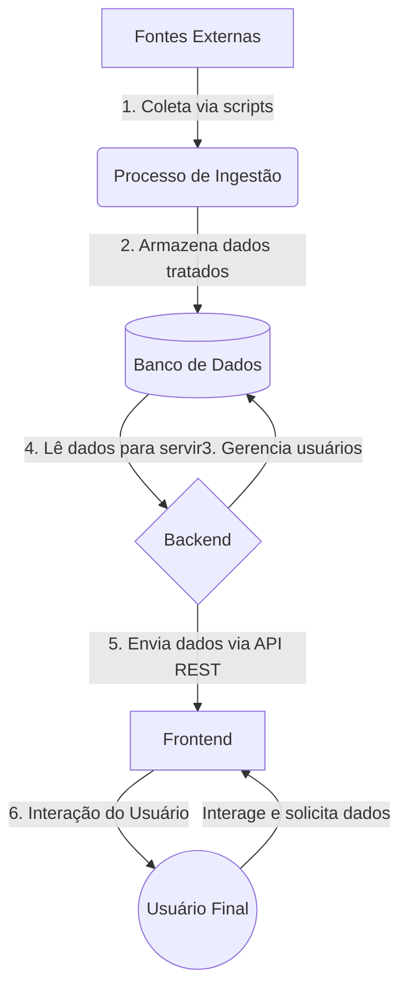

# Arquitetura da Solução ÁguaPrev

A arquitetura do projeto ÁguaPrev foi desenhada de forma modular, separando as responsabilidades em três grandes componentes: **Frontend**, **Backend** e um processo de **Ingestão de Dados**.

## Componentes Principais

1.  **Frontend (Cliente Web)**
    *   **Tecnologia:** Vite + TailwindCSS.
    *   **Responsabilidade:** Interface do usuário (UI) e Experiência do Usuário (UX). É por onde o usuário interage com o sistema, visualiza os dados, mapas e gráficos.
    *   **Comunicação:** Consome a API RESTful exposta pelo Backend para obter todos os dados necessários.

2.  **Backend (Servidor da API)**
    *   **Tecnologia:** Python com Flask.
    *   **Responsabilidade:** Orquestrar a lógica de negócio, gerenciar a autenticação de usuários (via JWT) e expor uma API RESTful para o frontend. Ele serve como a ponte entre os dados armazenados e a interface do usuário.
    *   **Comunicação:** Responde às requisições do Frontend e acessa o banco de dados para ler ou escrever informações.

3.  **Banco de Dados**
    *   **Tecnologia:** SQLite.
    *   **Responsabilidade:** Armazenar de forma persistente os dados da aplicação, que incluem:
        *   Dados dos usuários (perfis, senhas criptografadas).
        *   Inventário das estações de monitoramento.
        *   Séries temporais de dados hídricos (chuva, nível, vazão) coletados pelo processo de ingestão.

4.  **Ingestão de Dados (Processo em CLI)**
    *   **Tecnologia:** Scripts Python (`hidro_ingest.py`, `hidro_api.py`).
    *   **Responsabilidade:** Coletar dados brutos de fontes externas, como a API **HidroWeb da Agência Nacional de Águas (ANA)**. Os scripts tratam e estruturam esses dados antes de inseri-los no banco de dados SQLite.
    *   **Execução:** É um processo executado via linha de comando (CLI), de forma independente da aplicação web.

## Fluxo de Dados

O fluxo de dados principal pode ser entendido da seguinte forma:



### Detalhes do Fluxo:

1.  **Coleta:** O processo de ingestão é iniciado manualmente (via CLI) e faz requisições à API da ANA para buscar dados de estações e suas medições.
2.  **Armazenamento:** Os dados coletados são limpos, processados e salvos nas tabelas apropriadas do banco de dados SQLite.
3.  **Gerenciamento de Usuários:** O Backend lida com cadastro, login e perfis, salvando essas informações no banco.
4.  **Leitura de Dados:** Quando o frontend solicita dados (ex: para um gráfico no dashboard), o Backend consulta o banco de dados SQLite.
5.  **Exposição via API:** O Backend formata os dados em JSON e os envia para o frontend em resposta a uma chamada de API.
6.  **Visualização:** O frontend recebe o JSON e renderiza as informações de forma visual para o usuário final.

## Arquitetura de Machine Learning

Além do fluxo de dados hídricos, a aplicação possui uma arquitetura dedicada para o treinamento e a implantação de modelos de previsão de séries temporais.

O fluxo de Machine Learning é separado em duas fases: **Treinamento (Offline)** e **Inferência (Online)**.

```mermaid
graph TD
    subgraph Treinamento (Offline)
        direction LR
        T1[Dados Históricos] --> T2{Jupyter Notebooks};
        T2 --> |Exploração, Feature Engineering, Tuning| T3[Treinamento do Modelo];
        T3 --> T4[Artefatos do Modelo];
    end

    subgraph Deploy
        direction LR
        T4 --> |model.pkl, scaler.pkl, meta.json| D1[Backend];
    end
    
    subgraph Inferência (Online)
        direction TD
        I1[Frontend] -->|1. Requisição com dados recentes| D1;
        D1 -->|2. Pré-processa features (usa meta.json)| I2[Pipeline de Inferência];
        I2 -->|3. Normaliza (usa scaler.pkl)| I3[Aplicação do Modelo];
        I3 -->|4. Prevê (usa model.pkl)| I4[Previsão];
        I4 -->|5. Salva no DB| I5[(Banco de Dados)];
        I4 -->|6. Retorna para o cliente| I1;
    end

    subgraph Retreino (Manual)
        direction LR
        R1[Dados mais recentes] -->|Inicia novo ciclo| T2;
    end

```

### Detalhes do Fluxo de ML:

1.  **Treinamento (Offline):**
    *   **Ambiente:** O processo acontece em notebooks Jupyter, que são ideais para exploração de dados, engenharia de features, treinamento e validação de modelos.
    *   **Artefatos Gerados:** Ao final de um ciclo de treinamento bem-sucedido, três artefatos principais são salvos:
        *   `model_HORIZONTE_MODELO_vX.pkl`: O objeto do modelo treinado (ex: RandomForest, SARIMA).
        *   `scaler_HORIZONTE_vX.pkl`: O normalizador (ex: MinMaxScaler) já "fitado" com os dados de treino. É crucial para garantir que os dados de inferência sejam processados da mesma forma.
        *   `meta_HORIZONTE_vX.json`: Um arquivo de metadados que descreve as features esperadas pelo modelo, sua ordem, os lags utilizados e outras informações necessárias para reproduzir o pipeline de pré-processamento no backend.

2.  **Deploy e Inferência (Online):**
    *   **Carregamento:** O Backend é responsável por carregar os artefatos (`.pkl`, `.json`) na inicialização.
    *   **Endpoint `/prever`:** A API expõe uma rota `/prever`. Quando o frontend (ou outro cliente) envia uma requisição com dados recentes, o backend:
        1.  Usa o `meta.json` para construir as mesmas features do treinamento (lags, deltas, etc.).
        2.  Aplica o `scaler.pkl` para normalizar os dados.
        3.  Chama o método `predict()` do `model.pkl`.
        4.  Salva o resultado da previsão no banco de dados para monitoramento e comparação futuro (previsto vs. realizado).
        5.  Retorna a previsão formatada em JSON para o cliente.

3.  **Re-treino (Manual):**
    *   O processo de re-treino ainda é manual. Quando necessário (ex: para incorporar dados mais recentes e evitar degradação do modelo), o ciclo de treinamento é executado novamente nos notebooks Jupyter.
    *   Novos artefatos (com versionamento, ex: `v2`, `v3`) são gerados e substituem os arquivos antigos no ambiente do backend.
