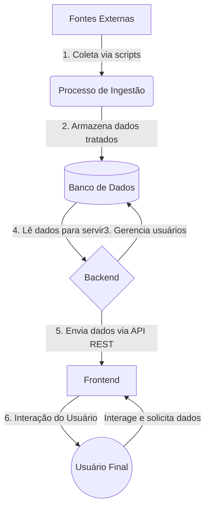

# Arquitetura da Solução ÁguaPrev

A arquitetura do projeto ÁguaPrev foi desenhada de forma modular, separando as responsabilidades em três grandes componentes: **Frontend**, **Backend** e um processo de **Ingestão de Dados**.

## Componentes Principais

1.  **Frontend (Cliente Web)**
    *   **Tecnologia:** Vite + TailwindCSS.
    *   **Responsabilidade:** Interface do usuário (UI) e Experiência do Usuário (UX). É por onde o usuário interage com o sistema, visualiza os dados, mapas e gráficos.
    *   **Comunicação:** Consome a API RESTful exposta pelo Backend para obter todos os dados necessários.

2.  **Backend (Servidor da API)**
    *   **Tecnologia:** Python com Flask.
    *   **Responsabilidade:** Orquestrar a lógica de negócio, gerenciar a autenticação de usuários (via JWT) e expor uma API RESTful para o frontend. Ele serve como a ponte entre os dados armazenados e a interface do usuário.
    *   **Comunicação:** Responde às requisições do Frontend e acessa o banco de dados para ler ou escrever informações.

3.  **Banco de Dados**
    *   **Tecnologia:** SQLite.
    *   **Responsabilidade:** Armazenar de forma persistente os dados da aplicação, que incluem:
        *   Dados dos usuários (perfis, senhas criptografadas).
        *   Inventário das estações de monitoramento.
        *   Séries temporais de dados hídricos (chuva, nível, vazão) coletados pelo processo de ingestão.

4.  **Ingestão de Dados (Processo em CLI)**
    *   **Tecnologia:** Scripts Python (`hidro_ingest.py`, `hidro_api.py`).
    *   **Responsabilidade:** Coletar dados brutos de fontes externas, como a API **HidroWeb da Agência Nacional de Águas (ANA)**. Os scripts tratam e estruturam esses dados antes de inseri-los no banco de dados SQLite.
    *   **Execução:** É um processo executado via linha de comando (CLI), de forma independente da aplicação web.

## Fluxo de Dados

O fluxo de dados principal pode ser entendido da seguinte forma:

### Detalhes do Fluxo:

1.  **Coleta:** O processo de ingestão é iniciado manualmente (via CLI) e faz requisições à API da ANA para buscar dados de estações e suas medições.
2.  **Armazenamento:** Os dados coletados são limpos, processados e salvos nas tabelas apropriadas do banco de dados SQLite.
3.  **Gerenciamento de Usuários:** O Backend lida com cadastro, login e perfis, salvando essas informações no banco.
4.  **Leitura de Dados:** Quando o frontend solicita dados (ex: para um gráfico no dashboard), o Backend consulta o banco de dados SQLite.
5.  **Exposição via API:** O Backend formata os dados em JSON e os envia para o frontend em resposta a uma chamada de API.
6.  **Visualização:** O frontend recebe o JSON e renderiza as informações de forma visual para o usuário final.
